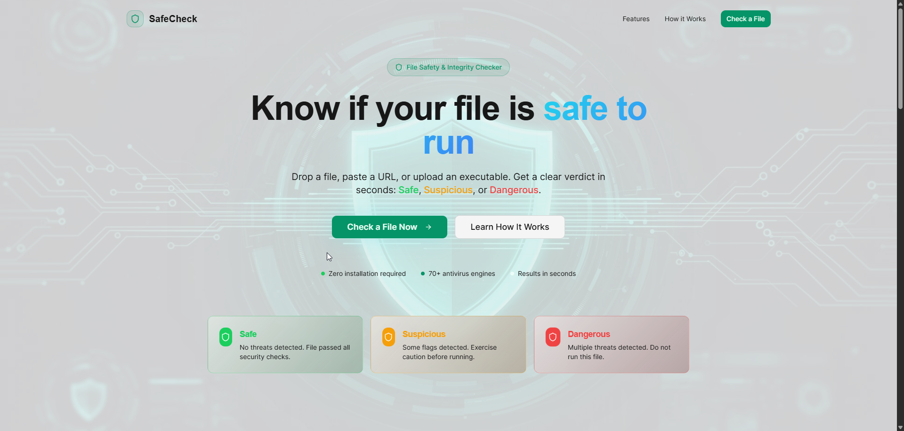
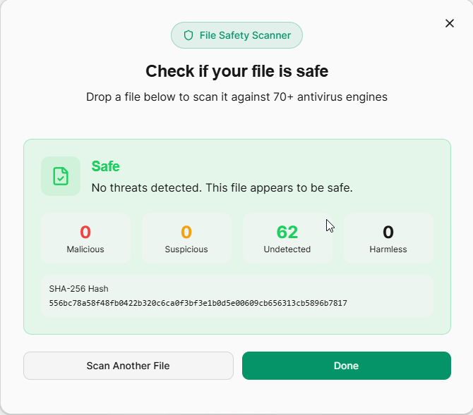

# SafeCheck

**A browser-based file assessment tool that helps users inspect repacks/cracks for suspicious characteristics BEFORE download/install.**

SafeCheck automates common manual checks — hashes, URL reputation, VirusTotal interpretation — into a simple workflow. **It is not a guarantee of safety** and cannot make pirated content "safe".


> **Who this is for:** People new to downloading repacks who don't know how to interpret VirusTotal flags, verify hashes, or identify fake sites. If you already do these checks manually, you probably don't need this.

---

## Table of Contents

- [What It Does](#what-it-does)
- [What It Doesn't Do](#what-it-doesnt-do)
- [Screenshots](#screenshots)
- [Privacy & Security](#privacy--security)
- [Self-Hosting](#self-hosting)
- [Getting Started](#getting-started)
- [How the Verdict Works](#how-the-verdict-works)
- [Roadmap](#roadmap)

---

## What It Does

| Feature | How It Works |
|---|---|
| **Source URL Checker** | Paste the download URL. Instantly checks against a database of verified legitimate and known fake sites. |
| **VirusTotal Scan** | Upload a file (under 32MB). Scans through 70+ engines and interprets results using weighted scoring — not raw flag counts. |
| **Hash Verification** | Paste a known-good hash. Tool computes SHA-256 locally in your browser. Match or mismatch, instant answer. |
| **Torrent Parser** | Drop a `.torrent` file. See the full file list before downloading. Flags unusual files (unexpected executables, oversized DLLs). |

---

## What It Doesn't Do

❌ **Does NOT guarantee a file is safe** — No tool can. This is risk assessment, not a security guarantee.

❌ **Is NOT a replacement for expert analysis** — Won't catch sophisticated malware or zero-days.

❌ **Only flags signals, not absolute verdicts** — "Safe" = no strong red flags. "Dangerous" = multiple reputable engines flagged serious threats.

❌ **Cannot detect novel malware** — If malware evades VirusTotal, this won't help. The URL checker is your strongest defense.

❌ **Not a substitute for common sense** — Stick to trusted sources. No tool can save you from random forum downloads.

---

## Screenshots

### Landing Page


### VirusTotal Result


---

## Privacy & Security

**TLDR:** Most operations run in your browser. File uploads go to VirusTotal via a proxy. Nothing is stored. Code is open source.

### What Runs Client-Side (In Your Browser)
- ✅ **SHA-256 hashing** — Uses browser's native `crypto.subtle` API. File never leaves your device.
- ✅ **Torrent parsing** — Parsed locally with `parse-torrent`. Nothing uploaded.
- ✅ **URL checking** — Checks local database. No network request.

### What Goes to the Server
- 📤 **VirusTotal scans** — File sent to backend proxy → proxy forwards to VirusTotal → result returned. File not stored.
- 🔍 **Hash lookups** — Hash (not file) sent to backend → proxy queries VirusTotal. Doesn't count against scan quota.

### Why a Proxy?
VirusTotal API key must stay secret. If it were in frontend code, anyone could steal it. Proxy hides the key. You can audit the code: `/server/src/index.ts`.

### Data Retention
**ZERO.** No files stored, no logs, no tracking, no analytics, no cookies (except HTTPS session).

---

## Self-Hosting

Don't trust the hosted version? Run your own.

### Run Locally

```bash
# Clone and install
git clone https://github.com/BrajamohanDas-afk/SafeCheck.git
cd SafeCheck
npm install

# Set up backend
cd server
npm install
```

Create `server/.env`:
```
PORT=3001
VIRUSTOTAL_API_KEY=your_key_here
```

Get a free key at [virustotal.com/gui/join-us](https://www.virustotal.com/gui/join-us).

```bash
# Terminal 1: Start backend
cd server
npm run dev

# Terminal 2: Start frontend
cd ..
npm run dev
```

Frontend: `http://localhost:5173`  
Backend: `http://localhost:3001`

### Deploy to Your Server

Options:
- **Render.com** (free tier)
- **Railway.app** (free tier)
- **Fly.io** (free tier)
- **Your own VPS** (DigitalOcean, Linode, etc.)

---

## Getting Started

**Quick Start (Frontend Only)** — hash verification and torrent parsing work without backend:

```bash
git clone https://github.com/BrajamohanDas-afk/SafeCheck.git
cd SafeCheck
npm install
npm run dev
```

**Full Setup** — enable VirusTotal scans:

Follow [Self-Hosting](#self-hosting) steps above to run both frontend and backend.

---

## How the Verdict Works

SafeCheck uses **weighted scoring** — not all engines are equal, not all flags are equal.

### Engine Tiers

| Tier | Engines | Weight |
|---|---|---|
| **Gold** | Kaspersky, Bitdefender, Norton, Malwarebytes | 3 points |
| **Silver** | Trend Micro, F-Secure, McAfee | 2 points |
| **Bronze** | Obscure engines | 1 point |

### Flag Types

| Type | Examples | Scoring |
|---|---|---|
| **Generic** | `HackTool`, `Crack`, `Keygen` | 0 points (expected) |
| **Suspicious** | `Adware`, `PUP`, `Bundler` | 50% weight |
| **Dangerous** | `Ransomware`, `Trojan.Stealer`, `Miner` | Full weight |

### Verdict Thresholds

| Score | Verdict | Meaning |
|---|---|---|
| 0–4 | ✅ Safe | Only generic crack flags |
| 5–9 | ⚠️ Suspicious | Some concerning signals |
| 10+ | 🚨 Dangerous | Multiple serious threats |

**Example:**
- Kaspersky: `HackTool` → 0 pts
- Norton: `PUP.Bundler` → 1.5 pts (50% of 3)
- Jiangmin: `Trojan.Generic` → 1 pt

**Total: 2.5 pts → Safe**

Every verdict shows an expandable "Why?" section with the full calculation.

---

## Tech Stack

- React + TypeScript
- Vite, Tailwind CSS, shadcn/ui
- Web Crypto API (client-side hashing)
- Express.js (backend proxy)
- VirusTotal API v3

---

## Disclaimer

SafeCheck cannot guarantee safety. It's a risk assessment tool. Always use common sense. Download from trusted sources only.

**Limitations:** Won't catch zero-days, novel malware, or targeted attacks. Good at interpreting VirusTotal flags and verifying integrity.

---

## Roadmap

| Phase | Status |
|---|---|
| **MVP** | ✅ Live — URL checker, VT scan, hash verify, torrent parser |
| **v1.1** | 🚧 In Progress — Missing file detector, community reporting, UI polish |
| **v2.0** | 📅 Planned — Browser extension for real-time fake site warnings |
| **v3.0** | 💡 Idea — Desktop app for process monitoring and miner detection |

---

## Contributing

Found a bug? [Open an issue](https://github.com/BrajamohanDas-afk/SafeCheck/issues)  
Want to contribute? Fork → feature branch → pull request  
Security issue? Email [your-email] (don't open public issue)

---

## License

MIT License — Free to use, modify, distribute. See [LICENSE](LICENSE).

---

### Built by [Brajamohan Das](https://github.com/BrajamohanDas-afk)
