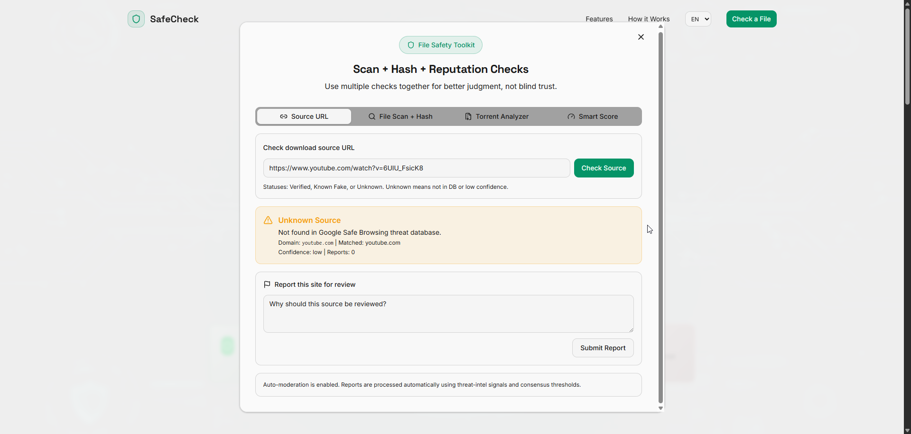
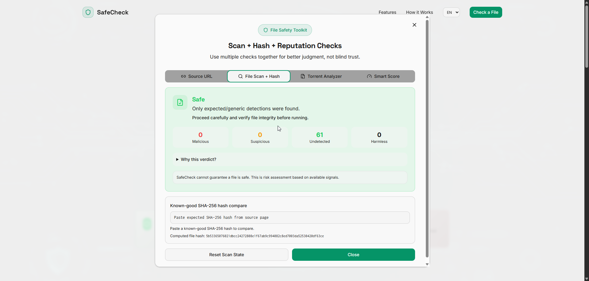
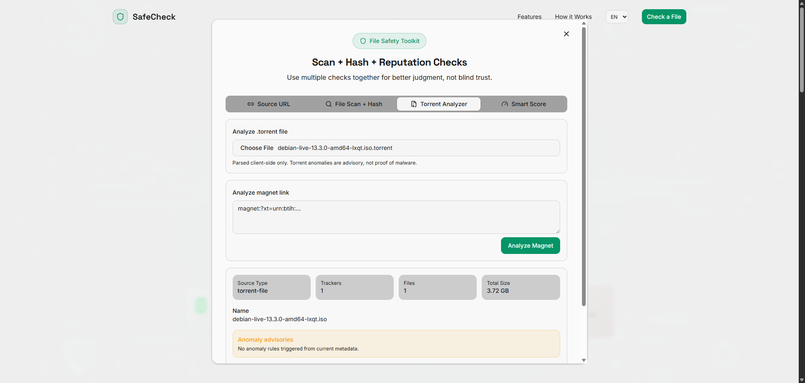
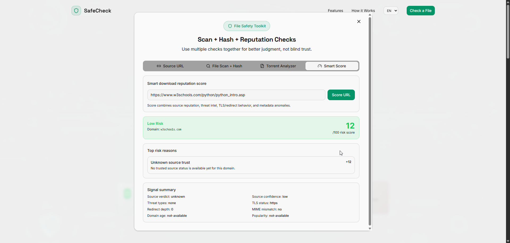

# SafeCheck

SafeCheck is a web app to verify downloaded files and source URLs before you run anything locally.

It combines source reputation checks, VirusTotal scanning, SHA-256 hash verification, torrent metadata analysis, smart risk scoring, and multilingual UI in one flow.

## Screenshots

### Landing Page


### File Safety Toolkit - Source URL



### File Safety Toolkit - File Scan + Hash



### File Safety Toolkit - Torrent Analyzer



### File Safety Toolkit - Smart Score



## Demo Video

- Google Drive: [Demo Video](https://drive.google.com/file/d/1snkXyUKoVNvGKAMMPZEBx69Cq7eoUE5X/view?usp=sharing)

## Features

- Source URL checker (`Verified`, `Known Fake`, `Unknown`)
- Community site reporting with auto-moderation workflow
- VirusTotal scan with hash-cache-first flow
- Weighted verdict engine (`Safe`, `Suspicious`, `Dangerous`) with explanations
- Local SHA-256 hash generation and known-hash comparison
- Torrent and magnet metadata analyzer with anomaly advisories
- Smart Download Reputation Score (`0-100`) with reasons
- Multilingual UI (Lingo.dev integration)

## Why SafeCheck (vs only VirusTotal)

VirusTotal is the malware intelligence engine. SafeCheck adds product logic and UX:

- Source trust checks before download/run
- Community reports and moderation queue
- Single final verdict with transparent reasoning
- Hash verification and URL risk scoring in same tool
- Better workflow for non-technical users

## Architecture

- Single Next.js app (UI + API routes)
- No separate Express backend required
- Route handlers in `src/app/api/*`
- Optional Supabase persistence for source/report history

## Tech Stack

- Next.js (App Router + Route Handlers)
- React + TypeScript
- Tailwind CSS + shadcn/ui
- Supabase (database)
- VirusTotal API v3
- Google Safe Browsing API
- Lingo.dev (i18n)

## Environment Variables

Create `.env.local` in project root:

```env
# Core scanning
VIRUSTOTAL_API_KEY=...
GOOGLE_SAFE_BROWSING_API_KEY=...

# Moderation
SITE_MODERATION_TOKEN=your_long_random_secret

# Supabase
SUPABASE_URL=https://YOUR_PROJECT_ID.supabase.co
SUPABASE_SERVICE_ROLE_KEY=...
NEXT_PUBLIC_SUPABASE_URL=https://YOUR_PROJECT_ID.supabase.co
NEXT_PUBLIC_SUPABASE_ANON_KEY=...

# Lingo.dev
LINGODOTDEV_API_KEY=...
LINGO_USE_PSEUDO_TRANSLATOR=false
LINGO_BUILD_MODE=cache-only
```

Notes:

- Keep real secrets only in `.env.local` (never commit).
- Commit only `.env.example` with placeholder values.

## Supabase Setup

1. Open Supabase SQL Editor.
2. Run `supabase/schema.sql`.
3. (Optional) Seed some rows in `public.site_sources` for demo.

Tables used:

- `scan_history`
- `site_sources`
- `site_reports`

## Local Development

Install:

```bash
npm install
```

Run dev:

```bash
npm run dev
```

Open:

`http://localhost:3000`

## Production Build (local)

```bash
npm run build
npm run start
```

## Deploy (Vercel)

1. Push repo to GitHub.
2. Import project in Vercel.
3. Add all env vars from `.env.local` to Vercel Project Settings.
4. Deploy.

If install fails due to peer dependencies, this repo already includes `.npmrc` with:

`legacy-peer-deps=true`

## Security Notes

- Uploaded files are scanned via API flow; do not commit secrets.
- Rotate keys immediately if any key was exposed in screenshots/logs.
- Service role keys must remain server-only.

## Roadmap

- Better queue/rate-limit observability
- More threat-intel providers
- Admin moderation dashboard improvements
- Exportable scan reports

## License

MIT. See `LICENSE`.

Built by [Brajamohan Das](https://github.com/BrajamohanDas-afk)
