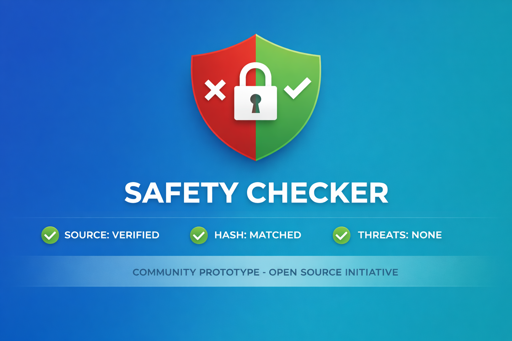

# SafeCheck

Verify downloaded files before you run them.

SafeCheck is a file integrity and security scanner for executables from untrusted sources. It combines VirusTotal analysis, local SHA-256 verification, and torrent metadata inspection in one app.



---

## Architecture (Important)

- Single Next.js app for both UI and API.
- No separate Express backend.
- No separate `server/` folder/service required.
- API logic runs in Next.js route handlers (`src/app/api/*`) on Node.js runtime.

---

## Core Features

- VirusTotal scan with hash-cache-first flow.
- Weighted verdict engine (`Safe`, `Suspicious`, `Dangerous`) with explanation.
- Local SHA-256 hash generation and hash compare.
- Torrent and magnet metadata analyzer with advisory anomaly flags.

---

## Legitimate Use Cases

1. Verifying open-source installers from mirror links.
2. Corporate IT security training demos.
3. Academic antivirus false-positive research.
4. Checking cloud backup file integrity after download.
5. Validating legal torrents (Linux ISOs, public domain media).

---

## Environment Setup

Create `.env.local` at the project root (same level as `package.json`):

```env
VIRUSTOTAL_API_KEY=your_virustotal_api_key

# Optional Supabase (for persistence)
NEXT_PUBLIC_SUPABASE_URL=https://your-project-id.supabase.co
NEXT_PUBLIC_SUPABASE_ANON_KEY=your_public_anon_key
SUPABASE_URL=https://your-project-id.supabase.co
SUPABASE_SERVICE_ROLE_KEY=your_service_role_key
```

**Required:**
- `VIRUSTOTAL_API_KEY`

**Optional:**
- Supabase keys (only needed if you want persisted data like `scan_history`)

---

## Install and Run

Install dependencies:

```bash
npm install
```

Run in development:

```bash
npm run dev
```

Open: `http://localhost:3000`

Run production locally:

```bash
npm run build
npm run start
```

---

## Supabase Schema (Optional)

If you use Supabase, apply the schema from `supabase/schema.sql`

---

## Privacy and Data Flow

**Client-side:**
- SHA-256 hashing
- Hash comparison
- Torrent/magnet parsing

**Next.js API routes:**
- VirusTotal hash lookup
- VirusTotal file upload + polling final report

SafeCheck does not store uploaded files.

---

## Verdict Model

**Scoring model:**
- Tier 1 engines: 3 points
- Tier 2 engines: 2 points
- Tier 3 engines: 1 point

**Classification:**
- Generic tool/packer detections: 0 points
- Suspicious detections: 50% of tier weight
- Dangerous detections: full tier weight

**Thresholds:**
- `0–4`: Safe
- `5–9`: Suspicious
- `10+`: Dangerous

---

## Tech Stack

- React
- Next.js (App Router + Route Handlers)
- TypeScript
- Tailwind CSS + shadcn/ui
- Supabase (optional)
- VirusTotal API v3

---

## License

MIT License — See [LICENSE](LICENSE) for details.

---

Built by [Brajamohan Das](https://github.com/BrajamohanDas-afk)